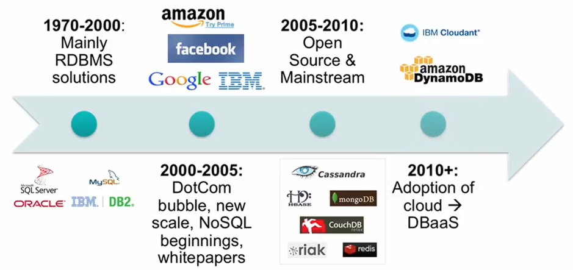
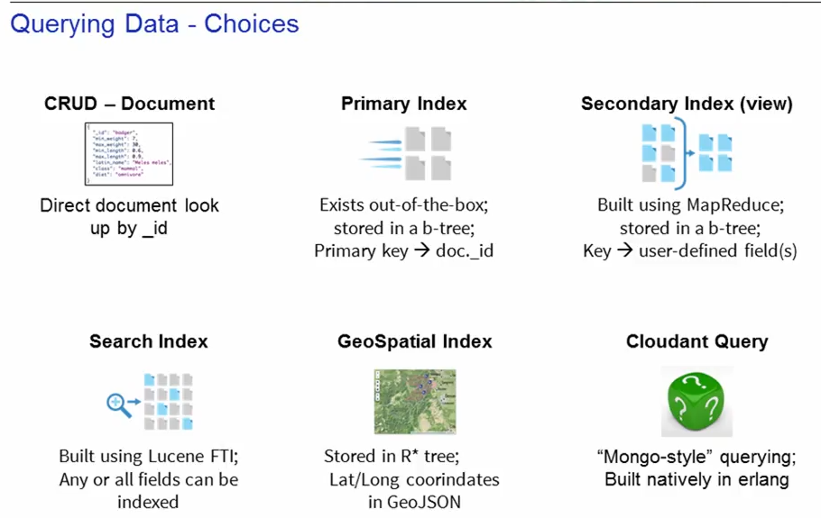

# Cloudant 

Syllabus

## Lesson 1: Introducting NoSQL

-    Define the term NoSQL and the technology it references.
-    Describe NoSQL history in the database landscape.
-    Explain concepts and characteristics of NoSQL databases.
-    List the primary benefits to adopting a NoSQL database.

## Lesson 2: Defining NoSQL Database Types, Options, and Use Cases

-    Define the major types of NoSQL Databases.
-    Describe the primary use cases of each.
-    Differentiate the major architectural differences between the types.

## Lesson 3: Choosing a Data Layer for Your Application

-    Differentiate local database system, hosted database, and database-as-a-service.
-    Examine relevant factors and considerations to determine an appropriate data layer.

## Lesson 4: Introducing Cloudant – a NoSQL DBaaS

-    List the key benefits of IBM Cloudant, a NoSQL Database-as-a-Service.
-    Describe Cloudant’s architecture.
-    List the features of Cloudant.
-    Explain the problems a Cloudant solution can solve.
-    Describe Cloudant’s deployment options.

## Lesson 5: Getting Started With IBM Cloudant: A Hands-On Introduction

-    Sign up for an IBM Cloudant account.
-    View your dashboard.
-    Create a database and add data documents.
-    Change database permissions.
-    Replicate a sample database.
-    Query data.
-    Work with the HTTP API.
-    Access documentation and support resources.

### Lesson 1: Introducting NoSQL

NoSQL --> Not only SQL  (Non Relational)

varieties! : 
- Key-Value, 
- Document,
- BigTable (also called Column-Oriented) 
- Graph style NoSQL databases.

### querying data
 
